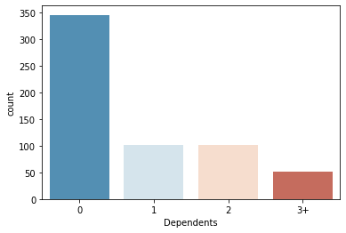

## Loan Prediction using Machine Learning

### Project Statement
The idea behind this project is to build a model that will classify how much loan the user can take. It is based on the user’s marital status, education, number of dependents, and employments.
### Approach
I have used K-Nearest Neighbors (KNN) to predict the loan status of the applicant and linear model to estimate how much the user can given the user's details.
## Algorithm used
### K-Nearest Neighbors (KNN) Algorithm
K-Nearest Neighbors (KNN) is one of the simplest algorithms used in Machine Learning for regression and classification problem. KNN algorithms use data and classify new data points based on similarity measures (e.g. distance function). Classification is done by a majority vote to its neighbors. The data is assigned to the class which has the nearest neighbors. As you increase the number of nearest neighbors, the value of k, accuracy might increase.

### Source to avail the dataset:- [Loan prediction dataset](https://www.kaggle.com/altruistdelhite04/loan-prediction-problem-dataset)
## Now, let us understand the implementation of K-Nearest Neighbors (KNN) in Python
###  Import the Libraries
We will start by importing the necessary libraries required to implement the KNN Algorithm in Python. We will import the **numpy** libraries for scientific calculation. Next, we will import the **matplotlib.pyplot** library for plotting the graph. We will import two machine learning libraries KNeighborsClassifier from sklearn.neighbors to implement the k-nearest neighbors vote and accuracyscore from **sklearn.metrics** for accuracy classification score.**Seaborn** is a Python data visualization library based on matplotlib. It provides a high-level interface for drawing attractive and informative statistical graphics.**pandas** is a Python package providing fast, flexible, and expressive data structures.
```
import pandas as pd
import numpy as np
import matplotlib.pyplot as plt
import seaborn as sns
%matplotlib inline
```
### Read the data
```
df=pd.read_csv("loan_train.csv")
df.head()
```

_#Heat map showing values which are not available or null_
```
sns.heatmap(df.isnull(),yticklabels=False,cbar=False,cmap='viridis')
```


We have to eliminate these null values

_#The get_dummies() function is used to convert categorical variable into dummy/indicator variables (0's and 1's)._
```
sex = pd.get_dummies(df['Gender'],drop_first=True)
married = pd.get_dummies(df['Married'],drop_first=True)
education = pd.get_dummies(df['Education'],drop_first=True)
self_emp = pd.get_dummies(df['Self_Employed'],drop_first=True)
loanStatus = pd.get_dummies(df['Loan_Status'],drop_first=True)
PropArea = pd.get_dummies(df['Property_Area'],drop_first=True)
df.drop(['Gender','Loan_ID','Self_Employed','Married','Education','Loan_Status','Property_Area'],axis=1,inplace=True)
df = pd.concat([df,married,education,sex,self_emp,loanStatus,PropArea],axis=1)
df.head()
```
_#Rename the columns after data manipulation._
```
df=df.rename(columns={'Yes':'Married','Male':'Gender','Yes':'Self_Employed'})
```
_#Heat map after introducing dummy variables._


 
### We can see that the attribute LoanAmount contains null values. We identify that the Loan Amount is related to whether the user is self employed. This is represented by the following Box-Plot


### We write the impute_LoanAmount function to replace the null Loan Amount values with the values calculated by the function
```
def impute_LoanAmt(cols):
    Loan = cols[0]
    selfemp = cols[1]
    
    if pd.isnull(Loan):

        if selfemp == 1:
            return 150
        else:
            return 125

    else:
        return Loan
```
_#Apply the impute_LoanAmt function on the dataset_

```
df['LoanAmount'] = df[['LoanAmount','Self_Employed']].apply(impute_LoanAmt,axis=1)
sns.heatmap(df.isnull(),yticklabels=False,cbar=False,cmap='viridis')
```
### From the below count plot we can see that most of the credit history values are 1.0. So we can replace the null values by 1.0.

```
sns.countplot(x='Credit_History',data=df,palette='RdBu_r')
```

```
df['Credit_History'].fillna(1.0,inplace=True)
```
### From the below count plot we can see that most of the Loan amount term values are 360. So we can replace the null values by 360.

```
sns.countplot(x='Loan_Amount_Term',data=df,palette='RdBu_r')
```

```
df['Loan_Amount_Term'].fillna(360,inplace=True)
```
### From the below count plot we can see that most of the 'Dependents' values are 0. So we can replace the null values by 0.

```
sns.countplot(x='Dependents',data=df,palette='RdBu_r')
```

```
df['Dependents'].fillna(360,inplace=True)
```
### Heatmap aftet eliminating all the null values
```
sns.heatmap(df.isnull(),yticklabels=False,cbar=False,cmap='viridis')
```


### StandardScaler will transform your data such that its distribution will have a mean value 0 and standard deviation of 1.Assume that all features are centered around 0 and have variance in the same order. If a feature has a variance that is orders of magnitude larger that others, it might dominate the objective function and make the estimator unable to learn from other features correctly as expected.

```
from sklearn.preprocessing import StandardScaler
scaler = StandardScaler()
train=pd.DataFrame(df.drop('Loan_Status',axis=1))
scaler.fit(train)
scaled_features = scaler.transform(train)
df_feat = pd.DataFrame(scaled_features,columns=train.columns)
```
### Train/Test Split
The data we use is usually split into training data and test data. The training set contains a known output and the model learns on this data in order to be generalized to other data later on. We have the test dataset (or subset) in order to test our model’s prediction on this subset.

_#Here we split the dataset 70/30....70% training dataset, 30% testing dataset._
```
from sklearn.model_selection import train_test_split
X_train, X_test, y_train, y_test = train_test_split(scaled_features,df['Loan_Status'],test_size=0.30)
```
### Now let predict the loan status using KNN algorithm. 

```
from sklearn.neighbors import KNeighborsClassifier
```
_#Let fit training dataset into the model. Let the initial value of k be 3._
```
knn = KNeighborsClassifier(n_neighbors=3)
knn.fit(X_train,y_train)
```
_#Predict the values using test dataset.
```
pred = knn.predict(X_test)
```
_#Print the classification reprot and confusion matrix_
```
from sklearn.metrics import classification_report,confusion_matrix
print(confusion_matrix(y_test,pred))
print(classification_report(y_test,pred))
```
### Confusion matrix

[[ 30  34]
 [ 14 107]]
 
### Classification report
```
 precision    recall  f1-score   support

 0       0.68      0.47      0.56        64
 1       0.76      0.88      0.82       121

accuracy                               0.74       185
macro avg          0.72      0.68      0.69       185
weighted avg       0.73      0.74      0.73       185
```
### To find a optimum value of k we plot a graph of error rate vs k value ranging from 0 to 40.
```
error_rate = []

for i in range(1,40):
    
    knn = KNeighborsClassifier(n_neighbors=i)
    knn.fit(X_train,y_train)
    pred_i = knn.predict(X_test)
    error_rate.append(np.mean(pred_i != y_test))
    
plt.figure(figsize=(10,6))
plt.plot(range(1,40),error_rate,color='blue', linestyle='dashed', marker='o',
         markerfacecolor='red', markersize=10)
plt.title('Error Rate vs. K Value')
plt.xlabel('K')
plt.ylabel('Error Rate')
```


### So from the graph wecan deduce that k=10 has least error rate. Hence we re_apply the algorithm for k=10.

```
knn = KNeighborsClassifier(n_neighbors=10)
knn.fit(X_train,y_train)
```
### Print the accuracy score
```
from sklearn.metrics import accuracy_score
print(accuracy_score(y_test,pred))
```
### We can see that the accuracy score has increased from 0.74 to 0.79.
# Linear regression
Linear regression is probably one of the most important and widely used regression techniques. It’s among the simplest regression methods. One of its main advantages is the ease of interpreting results.
## Problem formulation

When implementing linear regression of some dependent variable 𝑦 on the set of independent variables 𝐱 = (𝑥₁, …, 𝑥ᵣ), where 𝑟 is the number of predictors, you assume a linear relationship between 𝑦 and 𝐱: 𝑦 = 𝛽₀ + 𝛽₁𝑥₁ + ⋯ + 𝛽ᵣ𝑥ᵣ + 𝜀. This equation is the regression equation. 𝛽₀, 𝛽₁, …, 𝛽ᵣ are the regression coefficients, and 𝜀 is the random error.

Linear regression calculates the estimators of the regression coefficients or simply the predicted weights, denoted with 𝑏₀, 𝑏₁, …, 𝑏ᵣ. They define the estimated regression function 𝑓(𝐱) = 𝑏₀ + 𝑏₁𝑥₁ + ⋯ + 𝑏ᵣ𝑥ᵣ. This function should capture the dependencies between the inputs and output sufficiently well.

The estimated or predicted response, 𝑓(𝐱ᵢ), for each observation 𝑖 = 1, …, 𝑛, should be as close as possible to the corresponding actual response 𝑦ᵢ. The differences 𝑦ᵢ - 𝑓(𝐱ᵢ) for all observations 𝑖 = 1, …, 𝑛, are called the residuals. Regression is about determining the best predicted weights, that is the weights corresponding to the smallest residuals.
## Now we use linear regression to predict the loan amount based on user's details.
_#Assign the train and test datasets.
```
x=df[['Married', 'Not Graduate', 'Dependents',
       'Self_Employed','ApplicantIncome','CoapplicantIncome','Semiurban','Urban','Loan_Amount_Term']]
y=df['LoanAmount']
X_train,X_test,Y_train,Y_test=train_test_split(x,y,test_size=0.3,random_state=101)
```
```
from sklearn.linear_model import LinearRegression
```
_#Train the model to predict the values._
```
lm=LinearRegression()
lm.fit(X_train,Y_train)
```
Now we find the intercept
```
print(lm.intercept_)
```
**53.85642282094781**

### Now we print the values of coefficients. These coefficients can be used to find the value of loan amount that the user can take given the user's marital status, education, number of dependents, and employments.

```
coeff=pd.DataFrame(lm.coef_,x.columns,columns=['Coefficient'])
coeff
```


**Now let us predict the loan amount for a random set of values.**
```
lm.predict([[1,0,3,1,4000,3000,0,1,360]])
```
**187.17168163**

For the full code [press here](https://github.com/ankushbnayak/Loan-prediction-project/blob/master/Loan_prediction(1).ipynb)


   


